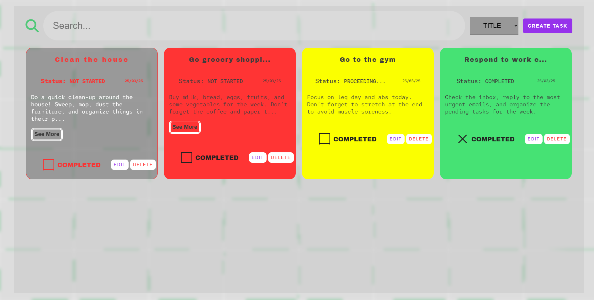

# CRUD-challenge

A simple **TO-DO-LIST** application following the principles of **CRUD** (Create, Read, Update, Delete)

## 🚀 Features

- 🔍 **Advanced Search**: Search for tasks by **title, status**, or **description**.
- ➕ **Task Creation**: Add new tasks quickly and intuitively.
- ✏️ **Task Editing**: Modify existing tasks.
- 🗑️ **Secure Delete**: Confirmation before deletion to prevent accidental actions.

## 📸 DISPLAY



## 🛠️ Technologies used

- **HTML5, CSS, JavaScript and PHP 8.1**
- **Frameworks: Composer and Laravel**
- **Back-end: Laravel**
- **Database: MySQL**

## 🚀 START

### 1️⃣ Clone the Repository

```bash
git clone https://github.com/seu-usuario/crud-challenge.git
```

### 2️⃣ Access the Project Folder

```bash
cd crud-challenge
```

### 📂In the front-end and back-end folders, they show how to start the application

💡 **Developed by [William](https://github.com/NodeWillDev/)** 🚀
