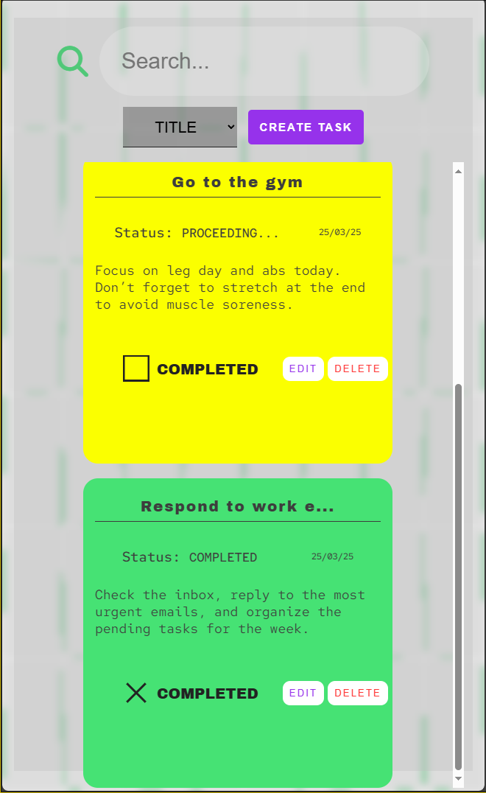
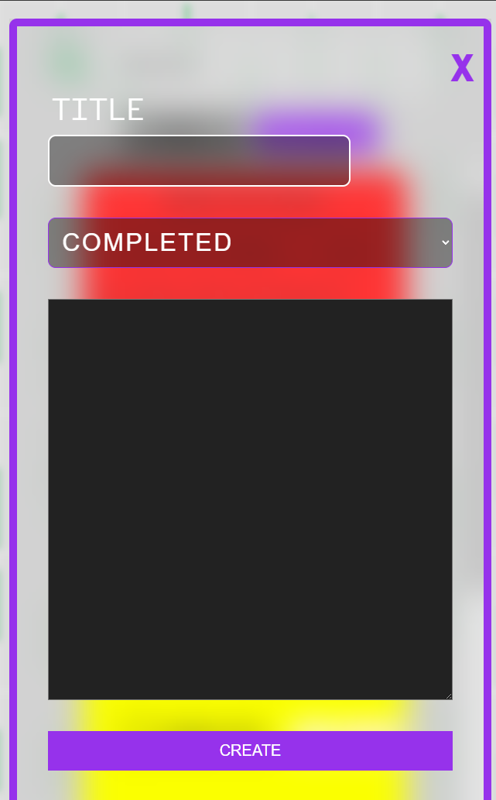

# 🚀 How to Start

1. ✅ **Make sure the backend is working properly**, checking endpoints.
2. ▶️ **Run the application**, which was developed using Live Server.

⚠️ **Observation:** The application will only be functional if the backend is configured and running correctly.

**Languages:** JavaScript, HTML and CSS.

# 📸 Project Demonstration

Here are some previews of how the project workso.

## 🔍 Task Search

See how easy it is to search for tasks registered in the system.

---

## ✏️ Task Editing

Edit your tasks quickly and efficiently.

---

## ➕ Task Creation

Add new tasks with just a few clicks.

---

## 📱 Responsiveness

The design is fully responsive, adapting to different screen sizes.

### Responsive View

### Creating a Task on Mobile

---

🚀 **Try it out and see how the application makes task management easier!**
